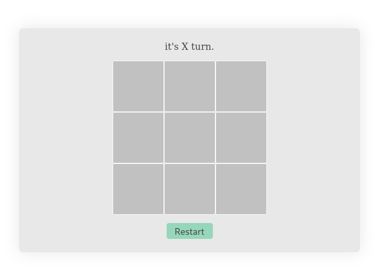
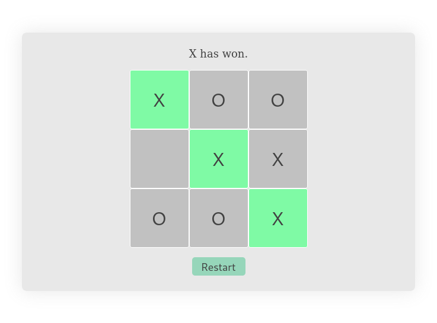
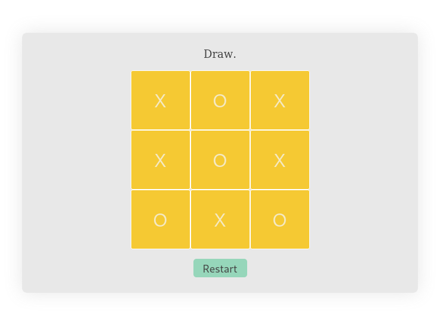

# Tic Tac Toe Game - React/TypeScript/Next.js

Welcome to the Tic Tac Toe game project, built using React, TypeScript, and Next.js. This project provides a fun and interactive way to enjoy the classic game of tic-tac-toe.

## Table of Contents

- [Info](#info)
- [Summary](#summary)
- [Screenshots](#screenshots)
- [Getting Started](#getting-started)
- [Learn More](#learn-more)
- [Deployment](#deployment)

## Info

- **Author:** [Z-Najdaoui](https://github.com/Z-Najdaoui)
- **Initial Release Date:** 2023/29/08
- **Last Edit Date:** 2023/29/08
- **Challenge Source:** [React Tutorial - Tic Tac Toe](https://react.dev/learn/tutorial-tic-tac-toe)

## Summary

Tic Tac Toe is a classic game built for entertainment. This project provides a digital version of the game, allowing players to enjoy a match of tic-tac-toe.

Thank you for taking a look at this project. Have fun playing! 😄

## Screenshots

### Start Page


### Winner Announcement


### Draw Scenario



## Getting Started

To run the development server, follow these steps:

1. Clone this repository.
2. Navigate to the project directory in your terminal.
3. Run one of the following commands:

   ```bash
   npm run dev
   # or
   yarn dev
   # or
   pnpm dev

Open [http://localhost:3000](http://localhost:3000) with your browser to see the result.

You can start editing the page by modifying `app/page.tsx`. The page auto-updates as you edit the file.

This project uses [`next/font`](https://nextjs.org/docs/basic-features/font-optimization) to automatically optimize and load Inter, a custom Google Font.

## Learn More

To learn more about Next.js, take a look at the following resources:

- [Next.js Documentation](https://nextjs.org/docs) - learn about Next.js features and API.
- [Learn Next.js](https://nextjs.org/learn) - an interactive Next.js tutorial.

You can check out [the Next.js GitHub repository](https://github.com/vercel/next.js/) - your feedback and contributions are welcome!

## Deploy on Vercel

The easiest way to deploy your Next.js app is to use the [Vercel Platform](https://vercel.com/new?utm_medium=default-template&filter=next.js&utm_source=create-next-app&utm_campaign=create-next-app-readme) from the creators of Next.js.

Check out our [Next.js deployment documentation](https://nextjs.org/docs/deployment) for more details.
